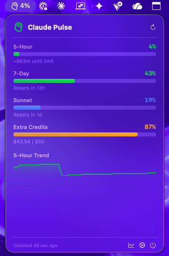

# Claude Pulse

A native macOS menubar app that monitors your Claude usage limits in real time. Glance at your usage from anywhere on your Mac — no terminal required.


<p align="center">
  
</p>

## Why This Exists

Every existing Claude usage tool lives inside the terminal. Claude Pulse breaks out into a native macOS citizen — a menubar app with visual progress bars, predictive burn rate, budget alerts, and a live countdown clock. It works whether Claude Code is running or not.

## Features

- **Menubar quick-glance** — persistent icon showing your 5-hour usage percentage
- **Visual dashboard** — frosted glass popover with progress bars for all usage windows
- **Per-model breakdown** — separate tracking for Sonnet and Opus
- **Extra credits tracking** — monitor your monthly spend with dollar amounts
- **Predictive burn rate** — linear regression estimates when you'll hit limits
- **Pace Coach** — context-aware tips when you're burning through quota
- **Live countdown clock** — ticking HH:MM:SS timer when you're near a limit
- **Budget alerts** — native macOS notifications at configurable thresholds (50/75/90/95%)
- **Usage history** — SQLite-backed sparkline trends and 7-day charts
- **Customizable** — poll interval, alert thresholds, 5 color themes
- **CLI tool included** — `ClaudePulseCLI` for terminal/scripting use

## Prerequisites

- **macOS 14 (Sonoma) or later**
- **Claude Pro or Max subscription** with Claude Code access
- **Claude Code installed** and logged in (the app reads your OAuth token from macOS Keychain)

## Quick Start

### Option 1: Build and run with Swift Package Manager

```bash
git clone https://github.com/stevemojica/claude-pulse.git
cd claude-pulse
swift build -c release
```

**Run the menubar app:**

```bash
# Create an app bundle
mkdir -p ~/Applications/Claude\ Pulse.app/Contents/MacOS
cp .build/release/ClaudePulse ~/Applications/Claude\ Pulse.app/Contents/MacOS/

# Create Info.plist (required for menubar + notifications)
cat > ~/Applications/Claude\ Pulse.app/Contents/Info.plist << 'EOF'
<?xml version="1.0" encoding="UTF-8"?>
<!DOCTYPE plist PUBLIC "-//Apple//DTD PLIST 1.0//EN"
  "http://www.apple.com/DTDs/PropertyList-1.0.dtd">
<plist version="1.0">
<dict>
    <key>CFBundleIdentifier</key>
    <string>com.claudepulse.app</string>
    <key>CFBundleName</key>
    <string>Claude Pulse</string>
    <key>CFBundleDisplayName</key>
    <string>Claude Pulse</string>
    <key>CFBundleExecutable</key>
    <string>ClaudePulse</string>
    <key>CFBundleVersion</key>
    <string>1.0</string>
    <key>CFBundleShortVersionString</key>
    <string>1.0</string>
    <key>CFBundlePackageType</key>
    <string>APPL</string>
    <key>LSUIElement</key>
    <true/>
    <key>LSMinimumSystemVersion</key>
    <string>14.0</string>
</dict>
</plist>
EOF

# Launch
open ~/Applications/Claude\ Pulse.app
```

**Or just run the CLI:**

```bash
swift run ClaudePulseCLI
```

### Option 2: Download the DMG

Check [Releases](https://github.com/stevemojica/claude-pulse/releases) for pre-built binaries.

## How It Works

Claude Pulse reads your OAuth token from the macOS Keychain (where Claude Code stores it) and polls the usage API every 60 seconds. No API keys to configure — if Claude Code is logged in, Claude Pulse just works.

```
macOS Keychain ("Claude Code-credentials")
    → OAuth token
        → GET https://api.anthropic.com/api/oauth/usage
            → Usage data displayed in menubar
```

### Data Flow

1. **OAuthResolver** reads your token from Keychain (handles `CLAUDE_CONFIG_DIR` hash suffix)
2. **UsageAPI** fetches current utilization from Anthropic's OAuth usage endpoint
3. **UsageCache** prevents API spam with a 60-second TTL
4. **HistoryStore** records snapshots to SQLite for trend analysis
5. **BurnRatePredictor** runs linear regression on recent snapshots
6. **BudgetAlerts** fires native macOS notifications at threshold crossings
7. **PaceCoach** generates contextual recommendations

### What Gets Tracked

| Window | Description |
|--------|-------------|
| 5-Hour | Current session utilization (resets every 5 hours) |
| 7-Day | Weekly aggregate across all models |
| Sonnet (7d) | Sonnet-specific weekly usage |
| Opus (7d) | Opus-specific weekly usage |
| Extra Credits | Monthly overage spend (in dollars) |

## Configuration

Click the gear icon in the dashboard popover to access settings:

- **Poll Interval** — how often to check usage (30s to 5min, default 60s)
- **Alert Thresholds** — toggle notifications at 50%, 75%, 90%, 95%
- **Accent Color** — green, blue, purple, orange, or teal

Settings are stored in `UserDefaults` and persist across launches.

## Project Structure

```
claude-pulse/
├── ClaudePulse/                  # Menubar app (SwiftUI)
│   ├── App.swift                 # @main entry with MenuBarExtra
│   ├── AppState.swift            # ObservableObject driving the UI
│   ├── MenuBarView.swift         # Dashboard popover
│   ├── ProgressBarView.swift     # Glossy progress bars
│   ├── SparklineView.swift       # 24h trend mini-graph
│   ├── CountdownView.swift       # Live reset countdown clock
│   ├── HistoryView.swift         # 7-day chart (Swift Charts)
│   └── SettingsView.swift        # Preferences panel
│
├── Shared/                       # Core library
│   ├── UsageModels.swift         # Codable API response types
│   ├── OAuthResolver.swift       # Keychain token resolution
│   ├── UsageAPI.swift            # API client
│   ├── UsageCache.swift          # 60s TTL cache (actor)
│   ├── HistoryStore.swift        # SQLite storage (WAL mode, thread-safe)
│   ├── BurnRatePredictor.swift   # Linear regression predictions
│   ├── BudgetAlerts.swift        # macOS notifications (actor)
│   ├── PaceCoach.swift           # Smart recommendations
│   ├── ColorTheme.swift          # Theme definitions
│   └── Constants.swift           # App-wide constants
│
├── ClaudePulseWidget/            # WidgetKit extension (planned)
├── Scripts/
│   ├── com.claudepulse.agent.plist  # LaunchAgent for auto-start
│   └── install.sh                   # LaunchAgent installer
├── Homebrew/
│   └── claude-pulse.rb           # Cask formula
├── Sources/                      # Swift Package Manager targets
│   ├── ClaudePulse/              # App target
│   ├── ClaudePulseCore/          # Library target
│   └── ClaudePulseCLI/           # CLI target
└── Package.swift
```

## Auto-Start at Login

To have Claude Pulse start automatically when you log in:

```bash
./Scripts/install.sh
```

This installs a LaunchAgent that keeps the app running in the background.

## Security

- **No API keys stored in code** — tokens are read from macOS Keychain at runtime
- **No credentials logged** — token values are never printed or written to disk
- **Thread-safe storage** — SQLite uses WAL mode with locking for concurrent access
- **Actor isolation** — cache and alert state are protected by Swift actors
- **Token expiry checks** — expired tokens trigger automatic re-resolution from Keychain

### Data Storage

| What | Where |
|------|-------|
| OAuth token | macOS Keychain (read-only, managed by Claude Code) |
| Usage history | `~/Library/Application Support/ClaudePulse/history.sqlite3` |
| Preferences | `UserDefaults` (`com.claudepulse.app.plist`) |

History is automatically pruned to 30 days.

## Contributing

Contributions are welcome! Some areas that could use help:

- [ ] **WidgetKit extension** — Notification Center widget reading from App Group JSON
- [ ] **Sparkle integration** — auto-update framework
- [ ] **Notarized DMG** — CI/CD pipeline for signed releases
- [ ] **Menu bar icon options** — ring indicator, numeric, or SF Symbol variants
- [ ] **Export** — CSV export of usage history
- [ ] **Cross-session aggregation** — read from `~/.claude/usage-data/`

## License

MIT License. See [LICENSE](LICENSE) for details.

## Acknowledgments

Built on patterns from the Claude Code community:
- [ClaudeCodeStatusLine](https://github.com/daniel3303/ClaudeCodeStatusLine) — OAuth token resolution approach
- [ccusage](https://github.com/nicobailon/ccusage) — session cost tracking concepts
- [CCometixLine](https://github.com/haleclipse/CCometixLine) — statusline design inspiration
