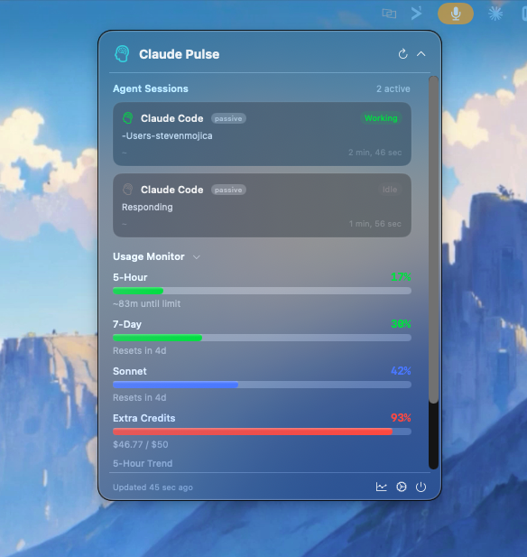

# Claude Pulse

A native macOS agent awareness hub that monitors your AI coding sessions and usage limits in real time. See what all your agents are doing, approve permissions without switching apps, and track your quota — all from a floating command bar.


<p align="center">
  
</p>

<p align="center">
  
</p>

## Why This Exists

When you're vibe coding with 5-10 agent conversations open, your brain can't track which sessions need attention, which finished, and which are waiting for approval. Claude Pulse surfaces the right information at the right moment with minimal friction — guiding your attention back to the right place.

**What makes it unique**: Claude Pulse is the only tool that merges **usage/budget intelligence** (burn rate, pacing, cost tracking) with **session awareness** (what are my agents doing right now?). You see not just *what* your agents are doing, but *how fast they're burning through your quota doing it*.

## Features

### Agent Session Tracking
- **Multi-agent support** — Claude Code, Codex, Gemini CLI, Cursor, OpenCode, Droid
- **Real-time status** — see which agents are working, idle, completed, or errored
- **Permission relay** — approve or deny agent tool calls directly from the command bar
- **Terminal jump** — click a session card to activate the correct terminal window/tab
- **Log file fallback** — detects Claude Code sessions even without hooks configured

### Floating Command Bar
- **Three states** — collapsed strip, preview, full dashboard
- **Non-activating overlay** — never steals focus from your editor
- **Auto-expand** — pops up when an agent needs your attention, auto-collapses after 5s
- **Global hotkey** — toggle with Cmd+Shift+P from anywhere
- **Works on all displays** — positions below the notch on MacBooks, top-center elsewhere

### Usage Intelligence
- **Visual progress bars** — all usage windows with glossy gradients and color thresholds
- **Per-model breakdown** — separate tracking for Sonnet and Opus
- **Extra credits tracking** — monitor monthly spend with dollar amounts
- **Predictive burn rate** — linear regression estimates when you'll hit limits
- **Agent-aware Pace Coach** — "3 agents running, at this burn rate you'll hit your 5h limit in 22 minutes"
- **Live countdown clock** — ticking HH:MM:SS when you're near a limit
- **Budget alerts** — native macOS notifications at configurable thresholds
- **Usage history** — SQLite-backed sparkline trends and 7-day charts

### Sound & Polish
- **Programmatic sound effects** — synthesized via AVAudioEngine, no shipped audio files
- **Customizable** — volume, on/off per event type, 5 accent color themes
- **Auto-updates** — Sparkle framework checks GitHub Releases with Ed25519 verification

## Prerequisites

- **macOS 14 (Sonoma) or later**
- **Claude Pro or Max subscription** with Claude Code access
- **Claude Code installed** and logged in (reads your OAuth token from macOS Keychain)

## Quick Start

### Build and run

```bash
git clone https://github.com/stevemojica/claude-pulse.git
cd claude-pulse
swift build -c release
```

**Run the app:**

```bash
# Create an app bundle
mkdir -p ~/Applications/Claude\ Pulse.app/Contents/MacOS
cp .build/release/ClaudePulse ~/Applications/Claude\ Pulse.app/Contents/MacOS/

# Create Info.plist (required for notifications + Sparkle updates)
cat > ~/Applications/Claude\ Pulse.app/Contents/Info.plist << 'EOF'
<?xml version="1.0" encoding="UTF-8"?>
<!DOCTYPE plist PUBLIC "-//Apple//DTD PLIST 1.0//EN"
  "http://www.apple.com/DTDs/PropertyList-1.0.dtd">
<plist version="1.0">
<dict>
    <key>CFBundleIdentifier</key>
    <string>com.claudepulse.app</string>
    <key>CFBundleName</key>
    <string>Claude Pulse</string>
    <key>CFBundleDisplayName</key>
    <string>Claude Pulse</string>
    <key>CFBundleExecutable</key>
    <string>ClaudePulse</string>
    <key>CFBundleVersion</key>
    <string>2.0</string>
    <key>CFBundleShortVersionString</key>
    <string>2.0</string>
    <key>CFBundlePackageType</key>
    <string>APPL</string>
    <key>LSUIElement</key>
    <true/>
    <key>LSMinimumSystemVersion</key>
    <string>14.0</string>
</dict>
</plist>
EOF

# Launch
open ~/Applications/Claude\ Pulse.app
```

**Or just run the CLI:**

```bash
swift run ClaudePulseCLI
```

### Download a release

Check [Releases](https://github.com/stevemojica/claude-pulse/releases) for pre-built binaries.

## Setting Up Agent Hooks

For real-time session tracking with permission relay, install the Claude Code hook:

```bash
./Scripts/install-hooks.sh
```

This adds a hook to `~/.claude/settings.json` that sends events to the Claude Pulse socket. Without the hook, Claude Pulse still detects sessions by watching log files (passive mode — status only, no permission relay).

## How It Works

### Architecture

```
┌─────────────────────────────────────────────────────┐
│                  Floating Command Bar                │
│  ┌──────────┐  ┌──────────┐  ┌────────────────────┐ │
│  │  Strip   │  │ Preview  │  │    Dashboard       │ │
│  │ (28px)   │→ │ (80px)   │→ │ Sessions + Usage   │ │
│  └──────────┘  └──────────┘  └────────────────────┘ │
└──────────────────────┬──────────────────────────────┘
                       │
         ┌─────────────┼─────────────┐
         ▼             ▼             ▼
┌─────────────┐ ┌────────────┐ ┌──────────────┐
│ Socket      │ │ Log        │ │ Usage API    │
│ Server      │ │ Watcher    │ │ (OAuth)      │
│ (real-time) │ │ (fallback) │ │ (polling)    │
└──────┬──────┘ └─────┬──────┘ └──────┬───────┘
       │              │               │
       ▼              ▼               ▼
  Claude Code    ~/.claude/      api.anthropic.com
  Hook Script    projects/*.jsonl
```

### Agent Detection

**Primary: Unix Socket** — The hook script sends JSON events to `~/Library/Application Support/ClaudePulse/pulse.sock`. This enables bidirectional communication including permission approval relay.

**Fallback: Log Watching** — Monitors `~/.claude/projects/` for JSONL file changes. Infers session status from message patterns. Read-only (no permission relay).

### Usage Monitoring

1. **OAuthResolver** reads your token from Keychain
2. **UsageAPI** fetches utilization from Anthropic's OAuth endpoint
3. **UsageCache** deduplicates with 60s TTL
4. **HistoryStore** records snapshots to SQLite for trends
5. **BurnRatePredictor** runs linear regression on recent data
6. **PaceCoach** generates tips factoring in active agent count

### What Gets Tracked

| Window | Description |
|--------|-------------|
| 5-Hour | Current session utilization (resets every 5 hours) |
| 7-Day | Weekly aggregate across all models |
| Sonnet (7d) | Sonnet-specific weekly usage |
| Opus (7d) | Opus-specific weekly usage |
| Extra Credits | Monthly overage spend (in dollars) |

## Configuration

Click the gear icon in the dashboard to access settings:

- **Poll Interval** — how often to check usage (30s to 5min, default 60s)
- **Alert Thresholds** — toggle notifications at 50%, 75%, 90%, 95%
- **Sound Effects** — enable/disable with volume control
- **Accent Color** — green, blue, purple, orange, or teal
- **Keyboard Shortcut** — Cmd+Shift+P to toggle (shown in settings)

Settings persist in `UserDefaults` across launches.

## Project Structure

```
claude-pulse/
├── Sources/
│   ├── ClaudePulse/                    # App target (SwiftUI + AppKit)
│   │   ├── ClaudePulseApp.swift        # @main entry, AppDelegate
│   │   ├── AppState.swift              # Usage monitoring state
│   │   ├── CommandBarWindow.swift      # NSPanel + controller
│   │   ├── CommandBarRootView.swift    # State switching
│   │   ├── CommandBarStripView.swift   # Collapsed strip
│   │   ├── CommandBarPreviewView.swift # Medium expansion
│   │   ├── CommandBarDashboardView.swift # Full dashboard
│   │   ├── ScreenLayout.swift          # Display positioning
│   │   ├── ProgressBarView.swift       # Glossy progress bars
│   │   ├── SparklineView.swift         # 24h trend mini-graph
│   │   ├── CountdownView.swift         # Live reset countdown
│   │   ├── HistoryView.swift           # 7-day chart
│   │   ├── SettingsView.swift          # Preferences panel
│   │   ├── SoundManager.swift          # Programmatic audio
│   │   └── UpdateManager.swift         # Sparkle auto-updates
│   │
│   ├── ClaudePulseCore/                # Shared library
│   │   ├── AgentSession.swift          # Session model + enums
│   │   ├── SessionManager.swift        # Session state management
│   │   ├── SessionProtocol.swift       # Socket wire protocol
│   │   ├── SocketServer.swift          # Unix domain socket server
│   │   ├── LogWatcher.swift            # JSONL log file monitor
│   │   ├── TerminalJumper.swift        # Terminal window activation
│   │   ├── SecurityPolicy.swift        # Input validation
│   │   ├── UsageAPI.swift              # HTTP client + models
│   │   ├── OAuthResolver.swift         # Keychain token resolution
│   │   ├── UsageCache.swift            # 60s TTL cache (actor)
│   │   ├── HistoryStore.swift          # SQLite storage (WAL)
│   │   ├── BurnRatePredictor.swift     # Linear regression
│   │   ├── BudgetAlerts.swift          # macOS notifications
│   │   └── PaceCoach.swift             # Smart recommendations
│   │
│   └── ClaudePulseCLI/                 # CLI target
│       └── main.swift
│
├── Scripts/
│   ├── claude-hook.sh                  # Claude Code hook script
│   ├── install-hooks.sh                # Hook auto-configurator
│   ├── generate-icns.sh                # Icon generator from PNG
│   ├── install.sh                      # LaunchAgent installer
│   └── com.claudepulse.agent.plist     # LaunchAgent config
│
├── SECURITY.md                         # Threat model & mitigations
├── Package.swift                       # SPM with Sparkle dependency
└── README.md
```

## Auto-Start at Login

```bash
./Scripts/install.sh
```

Installs a LaunchAgent that keeps Claude Pulse running in the background.

## Security

Claude Pulse handles OAuth tokens and inter-process communication. See [SECURITY.md](SECURITY.md) for the full threat model.

**Key measures:**
- **No API keys in code** — tokens read from macOS Keychain at runtime, never logged
- **Socket hardened** — `0600` permissions, peer UID validation via `getpeereid()`
- **Input validated** — strict JSON schema, 64KB max message size, shell metacharacter rejection
- **AppleScript sanitized** — TTY paths validated before interpolation
- **Auto-updates signed** — Sparkle Ed25519 signature verification
- **Zero runtime dependencies** — all Apple frameworks (Sparkle is the only addition)
- **Hardened Runtime** — required for notarization

### Data Storage

| What | Where |
|------|-------|
| OAuth token | macOS Keychain (read-only, managed by Claude Code) |
| Usage history | `~/Library/Application Support/ClaudePulse/history.sqlite3` |
| Socket | `~/Library/Application Support/ClaudePulse/pulse.sock` |
| Preferences | `UserDefaults` (`com.claudepulse.app.plist`) |

Session data is ephemeral (in-memory only). Usage history auto-prunes to 30 days.

## Contributing

Contributions welcome! Some areas that could use help:

- [ ] **WidgetKit extension** — Notification Center widget
- [ ] **More agent hooks** — Codex, Gemini CLI, Cursor hook scripts
- [ ] **Notarized DMG** — CI/CD pipeline for signed releases
- [ ] **Configurable hotkey** — let users pick their own shortcut
- [ ] **Export** — CSV export of usage history
- [ ] **tmux/screen support** — jump to specific tmux panes

## License

MIT License. See [LICENSE](LICENSE) for details.

## Acknowledgments

Built on patterns from the Claude Code community:
- [ClaudeCodeStatusLine](https://github.com/daniel3303/ClaudeCodeStatusLine) — OAuth token resolution approach
- [ccusage](https://github.com/nicobailon/ccusage) — session cost tracking concepts
- [CCometixLine](https://github.com/haleclipse/CCometixLine) — statusline design inspiration
